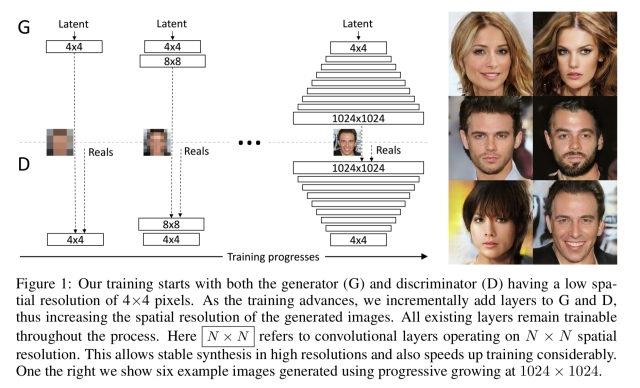
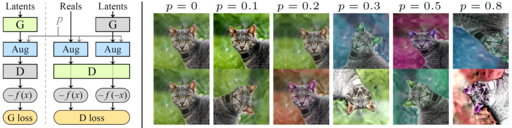

# Overview

A simple re-implementation of *Progressive Growing GAN* with Pytorch.



I also re-implemented the *Adaptive Discriminator Augmentation* technique to enhance generalization on small datasets.



# Requirements

* pytorch (LTS version)
* torchvision
* omegaconf
* icecream
* kornia 0.5.11
* scikit-image

# Training

Modify training configuration in ```./config/train_wgan.yaml```. Make sure that the ```target_resolution``` is a power of 2.

Train from scratch: ```python train_wgan.py -r run_name -c ./config/train_wgan.yaml```.

All training information will be put in ```./train/run_name```. You can use ```-o``` flag to overwrite the existing checkpoint directory.

You can also resume training from a checkpoint: ```python train_wgan.py -r run_name --resume```


